# SmartCare HMS

A role-based **Hospital Management System** built with **Django** to digitize hospital workflows such as patient registration, doctor approval, appointment booking, prescription management, report follow-up, diagnostic test reporting, and basic health guidance through **MediBot**.

---

## Overview

**SmartCare HMS** is a web-based healthcare management platform designed to connect **patients, doctors, receptionists, and administrators** in one integrated system.

The project aims to reduce manual hospital workload, improve service efficiency, support better follow-up care, and provide a cleaner digital workflow for both patients and healthcare staff.

---

## Key Features

### Patient Module
- Patient registration and login
- Doctor browsing by details and availability
- Appointment booking
- Prescription archive
- Report upload and follow-up support
- MediBot basic symptom guidance

### Doctor Module
- Secure login with approval validation
- Pending and completed appointment management
- Prescription creation
- Report review
- Patient bookmarking for follow-up care

### Receptionist Module
- Walk-in appointment creation
- Patient handling and support
- Test report generation
- Billing summary handling
- Report print/download support

### Admin Module
- Doctor approval workflow
- User monitoring
- Appointment statistics and overview
- Message monitoring and system-level control

---

## User Roles

The system supports four major user roles:

- **Admin**
- **Doctor**
- **Patient**
- **Receptionist**

Each role has separate dashboards and access permissions for secure and organized workflow management.

---

## Technology Stack

### Frontend
- HTML
- CSS
- JavaScript
- Bootstrap

### Backend
- Django (Python)

### Database
- SQLite

### Version Control & Tools
- Git
- GitHub

---

## Core Modules

- Appointment Management
- Prescription Management
- Report Show / Follow-up Module
- Medical Test & Test Report Module
- Contact Message Module
- Doctor Approval Workflow
- MediBot Patient Support Module

---

## Security Features

- Role-Based Access Control (RBAC)
- Django authentication system
- Password hashing
- CSRF protection
- Session management
- Client-side and server-side validation
- Controlled error messages
- Doctor approval guard

---

## System Architecture

The system follows a **5-layer architecture**:

- **Presentation Layer** – dashboards and user interfaces
- **Application Layer** – Django views, URLs, forms, and validation
- **Business Module Layer** – appointments, prescriptions, reports, MediBot, approval workflow
- **Data Layer** – Django ORM and SQLite database
- **Security Layer** – authentication, CSRF protection, password security, and role-based access

---

## Project Objectives

- To transform hospital management into a digital and organized system
- To create role-based dashboards for all major users
- To unify online and offline appointment workflows
- To simplify prescription and report follow-up
- To strengthen authentication and access control
- To provide patient-friendly initial health guidance through MediBot

---

## Future Improvements

- Online payment integration
- SMS or email notifications
- Pharmacy integration
- Lab automation
- AI-powered advanced triage
- Multilingual chatbot support
- Mobile application
- Analytics dashboard

---

## Screenshots

Add your real project screenshots inside a `screenshots/` folder.

Example:

```markdown
## Screenshots

Home Page
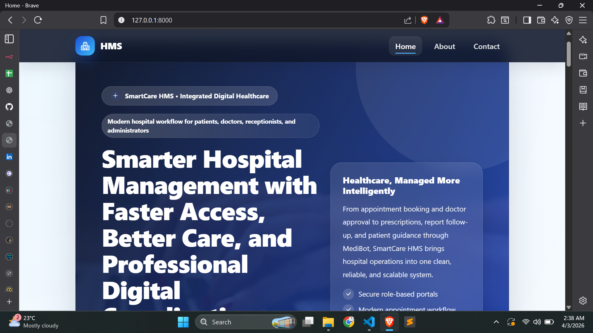

### About Page
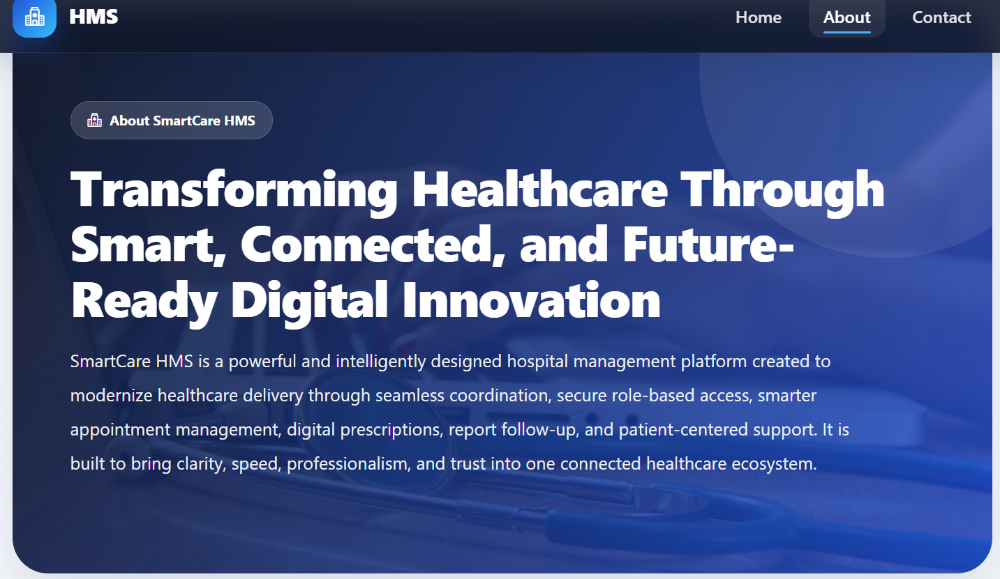

### Contact Page
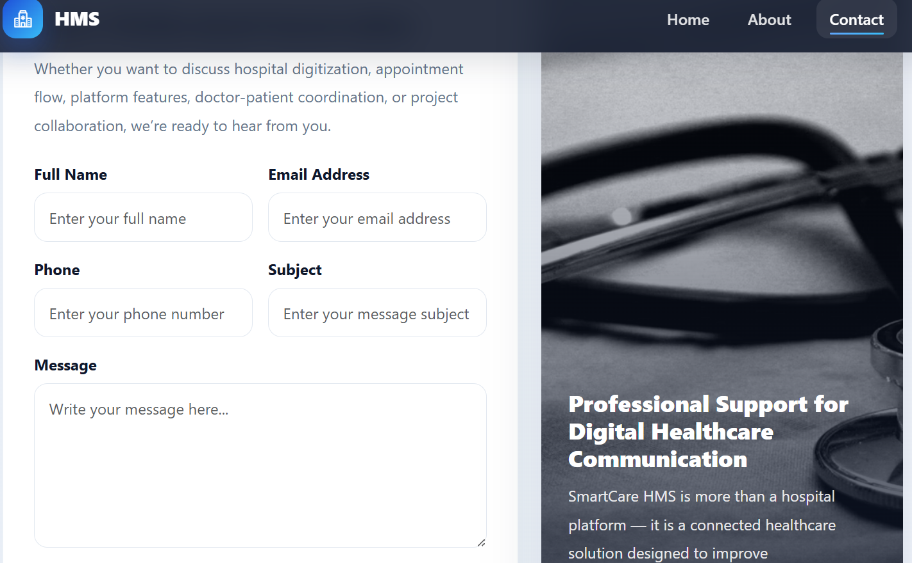

### Role-Based login Page
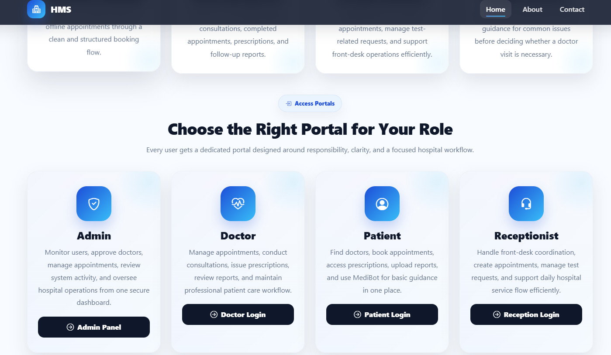

### Patient Dashboard Page
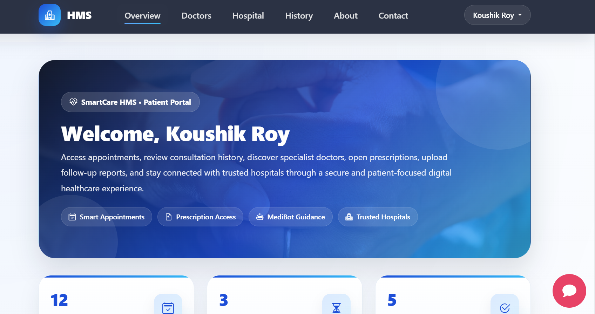

### Patient Profile Page
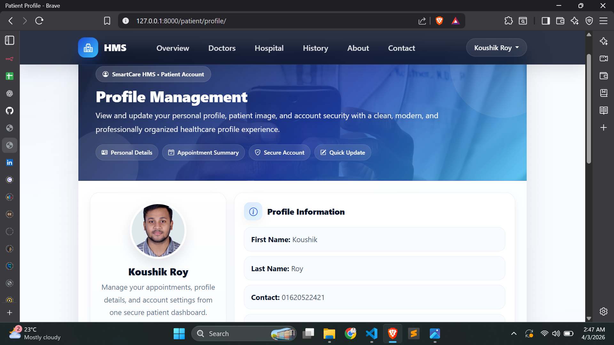

### Patient Medibot Page
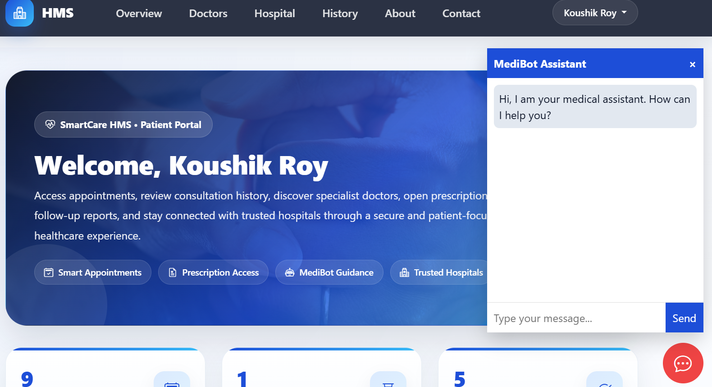

### Patient Follor-Up_Report Page
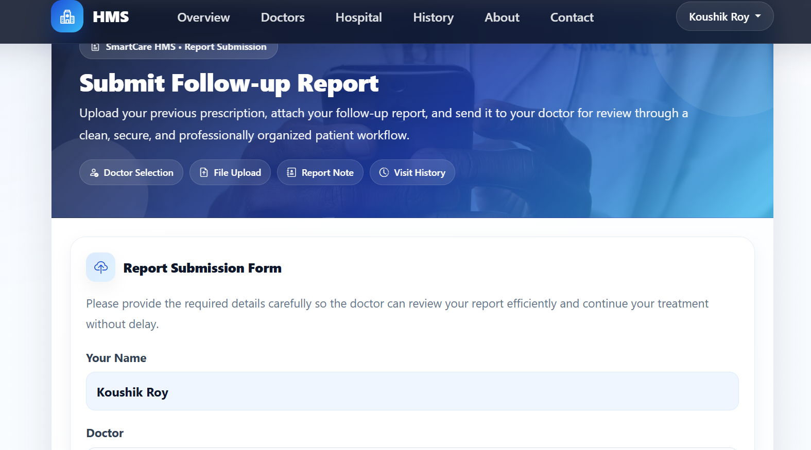

### Patient Appointment-Book Page
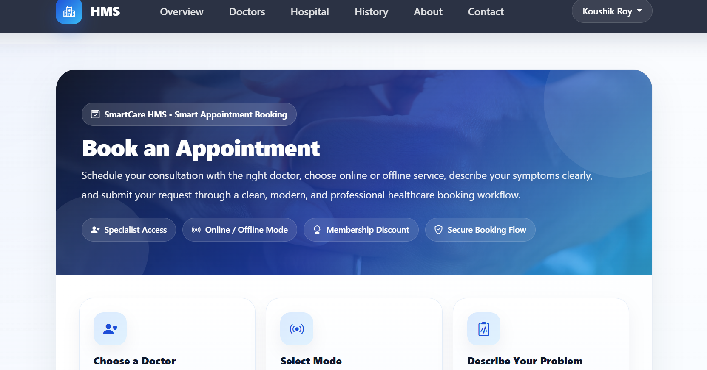

### Patient Prescription_View Page
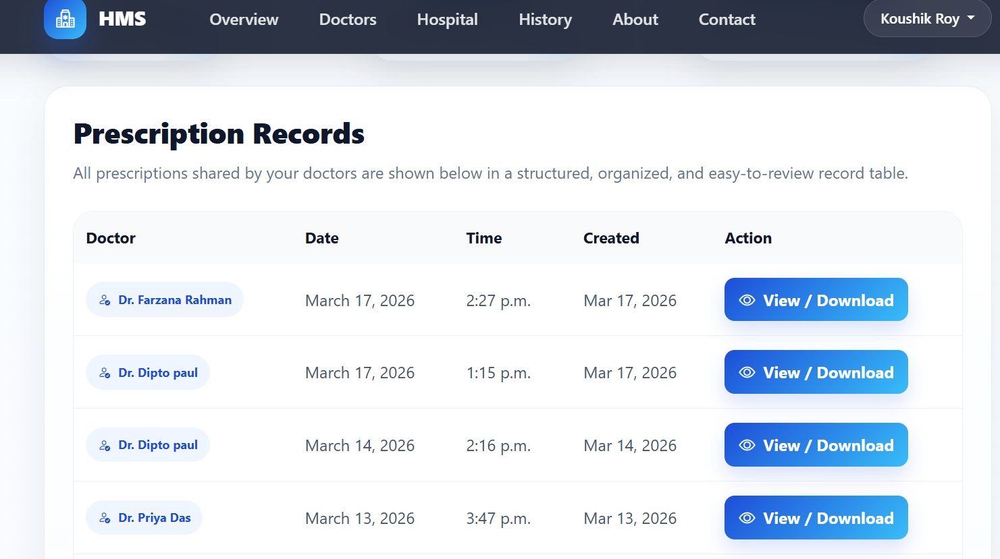

### Doctor Dashboard Page


### Doctor Dashboard Page


### Doctor Prescription Creation Page
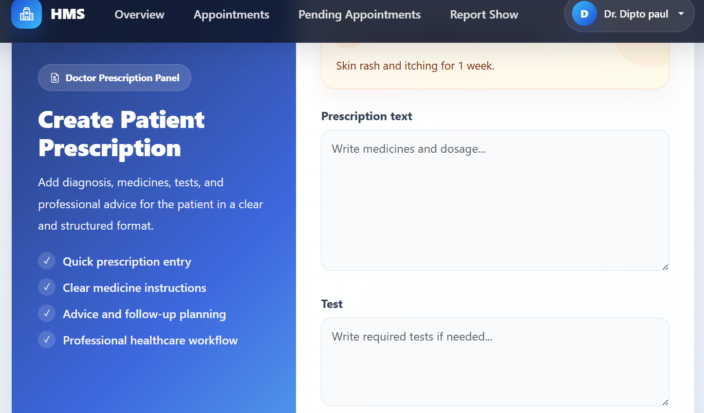

### Receptionist Dashboard
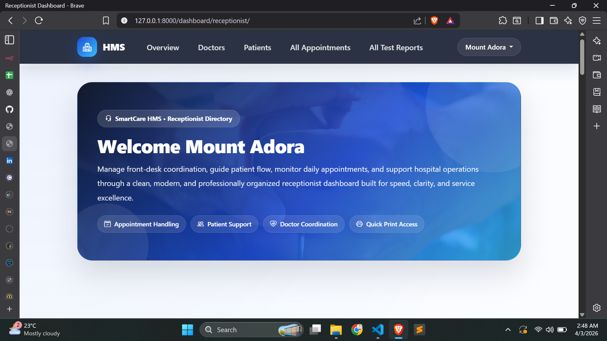

### Receptionist Appointment Create Page
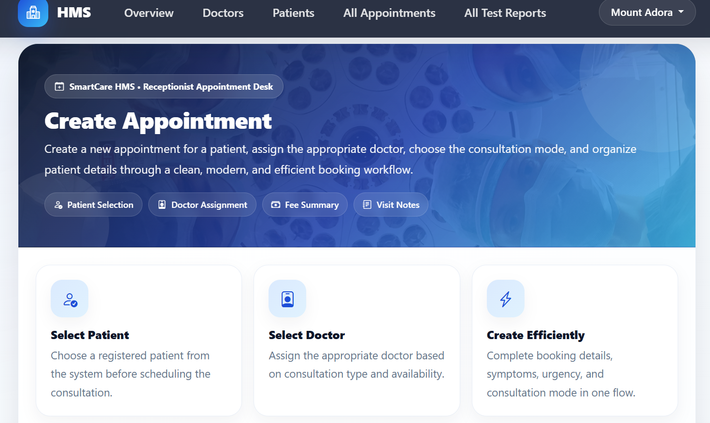

### Receptionist Doctor Available  Page


### Receptionist Walk-In-Patient Page


### Admin Dashboard
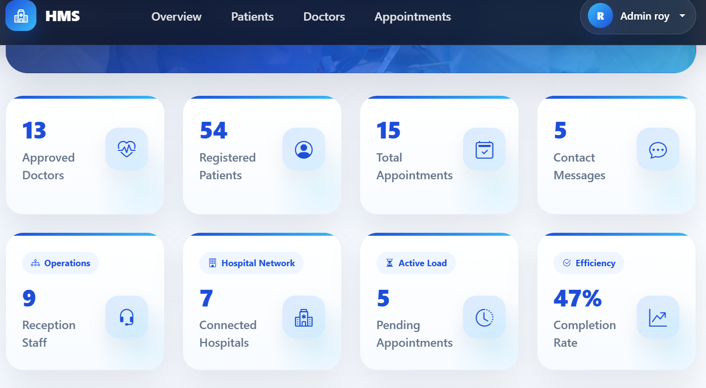
